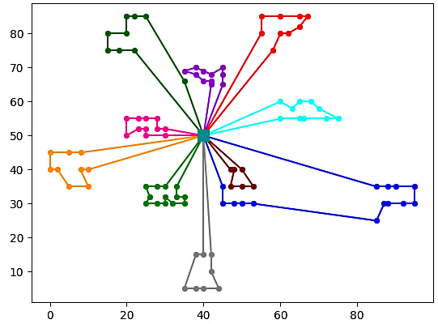

# CDELS

<!-- PROJECT LOGO -->
<br />
<p align="center">
  <a href="https://github.com/israelpereira55/MDVRPTW-Solomon">
    
  </a>

  <h3 align="center">An algorithm based on Differential Evolution with Local Search for the CVRP.</h3>

  <p align="center">
    This is an algorithm that seeks to get the optimum solutions for the CVRP. 
    <br />
    The coded heuristics are explained in the published article [1]. If you use this code, please cite us in your article or work! =)
    <br />
  </p>
</p>


<!-- TABLE OF CONTENTS -->
<details open="open">
  <summary>Table of Contents</summary>
  <ol>
    <li>
      <a href="#about-the-project">About The Project</a>
    </li>
    <li>
      <a href="#getting-started">Getting Started</a>
      <ul>
        <li><a href="#prerequisites">Prerequisites</a></li>
        <li><a href="#setup">Setup</a></li>
      </ul>
    </li>
    <li><a href="#contact">Contact</a></li>
    <li><a href="#thanks-to">Acknowledgments</a></li>
    <li><a href="#references">References</a></li>
  </ol>
</details>


<!-- ABOUT THE PROJECT -->
## About The Project

The Capacitated Vehicle Routing Problem (CVRP) is a known combinatorial problem for its difficulty (NP-hard).

This project started when I chose the Differential Evolution in a metaheuristics competition in a class at the university to solve the CVRP. I got third place, but then started studying it with other two professors for more than four years. 

I love the Differential Evolution metaheuristic. So, we have proposed a combinatorial adaptation for DE for CVRP, that can also be applied to other combinatorial problems.

In the literature, there are several DE adaptations for combinatorial problems. Teoh et al. [2] have done a great article using DE for CVRP, which uses an easy-to-code adaptation for DE proposed by (Mingyong,  L.  and  Erbao,  C), which ranks the real numbers and assigns integers considering the ranks of the numbers, where a lower number are assigned to lower integers. It's not only easy to code but also gives good results. We have proposed an algorithm based on DE with an adaptation for mutation and crossover DE mechanisms. This adaptation uses the position of the clients in chromosomes which presented a better result than arithmetically updating their values. The complete algorithm is explained detailed in our article [1].

I'm publishing the code to make it easier to reproduce. Sadly, it's not a common practice for papers in the optimization area, but we can change that! ;)

The CDELS stands for Combinatorial Differential Evolution with Local Search. CDELS is coded in C language.
 


<!-- GETTING STARTED -->
## Getting Started

First, you need a CVRP problem instance, which you can get on VRP Libraries.
We will list some libraries in which you can get them. We also have the "instances" folder with some CVRPLIB instances, mostly for backup purposes but you can use them too.

You can make your instance. It just needs to follow [TSPLIB95](http://www.or.uni-bonn.de/lectures/ws17/co_exercises/programming/tsp/tsp95.pdf) standards using customers with 2D dimensions. In this CDELS version, **instances using distance matrix ARE NOT SUPPORTED**.

* [CVRPLIB](http://vrp.atd-lab.inf.puc-rio.br/)


If you are creating your instance and don't know the optimum value just write a low value which should be
below than it's lower bound (just write a small integer! ;) ).

**Important:** We are using the [TSPLIB95](http://www.or.uni-bonn.de/lectures/ws17/co_exercises/programming/tsp/tsp95.pdf) standard that rounds to the nearest integer the operation cost with floating numbers. If you don't want that, modify the distance matrix creating function.


### Prerequisites

gcc and make.


### Setup

1. Modify the parameters
    * [differential_evolution.h](https://github.com/israelpereira55/CDELS/blob/master/metaheuristic/differential_evolution.h)

      To choose the F, CR, Penalty, and MaxGen parameters.


    * [main.c](https://github.com/israelpereira55/CDELS/blob/master/main.c)


      To choose the NP parameter.

2. Run the project
   ```sh
   make
   make run
   ```
   
To plot the solution you can use [CVRPPLOT](https://github.com/israelpereira55/CVRPPLOT).


<!-- USAGE EXAMPLES 
### Parameters description

WIP!
-->

<!-- ACKNOWLEDGEMENTS  -->
## Limitations

In this implementation, only instances using _EDGE_WEIGHT_TYPE : EUC_2D_ are supported.


## Known bugs

TBD.

All solutions presented in the article were validated to ensure that they were feasible and had the exact solution cost as reported.

If you find an execution with unexpected results, please report presenting the instance file and the seed to reproduce the problem.


<!-- CONTACT -->
## Contact

Project Link: [https://github.com/israelpereira55/CDELS](https://github.com/israelpereira55/CDELS)

[![LinkedIn][linkedin-shield]][linkedin-url]


<!-- ACKNOWLEDGEMENTS  -->
## Acknowledgments

* [Best README Template](https://github.com/othneildrew/Best-README-Template)


## References

[1] Souza, Israel Pereira, Maria Claudia Silva Boeres, and Renato Elias Nunes Moraes. "A robust algorithm based on Differential Evolution with local search for the Capacitated Vehicle Routing Problem." Swarm and Evolutionary Computation (2023): 101245.

[2] Teoh, Boon Ean, Sivalinga Govinda Ponnambalam, and Ganesan Kanagaraj. "Differential evolution algorithm with local search for capacitated vehicle routing problem." International Journal of Bio-Inspired Computation 7.5 (2015): 321-342.

[3] Storn, Rainer, and Kenneth Price. "Differential evolution–a simple and efficient heuristic for global optimization over continuous spaces." Journal of global optimization 11.4 (1997): 341-359.

[4] Reinelt, Gerhard. "Tsplib95." Interdisziplinäres Zentrum für Wissenschaftliches Rechnen (IWR), Heidelberg 338 (1995): 1-16.


<!-- MARKDOWN LINKS & IMAGES -->
<!-- https://www.markdownguide.org/basic-syntax/#reference-style-links -->
[linkedin-shield]: https://img.shields.io/badge/-LinkedIn-black.svg?style=for-the-badge&logo=linkedin&colorB=555
[linkedin-url]: https://www.linkedin.com/in/israel-souza-06737118b/
[product-screenshot]: images/screenshot.png
